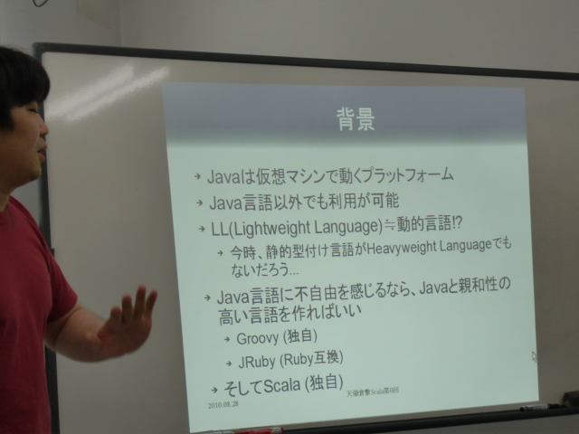
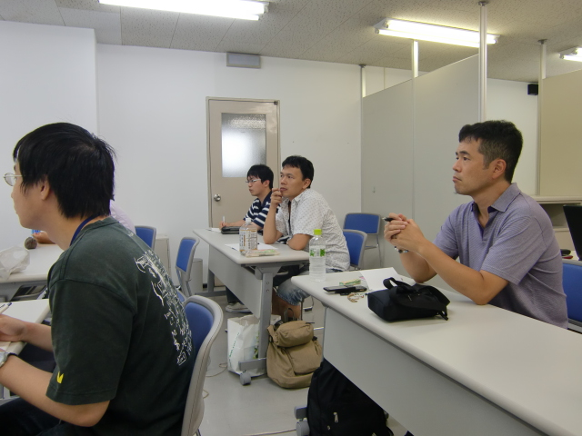
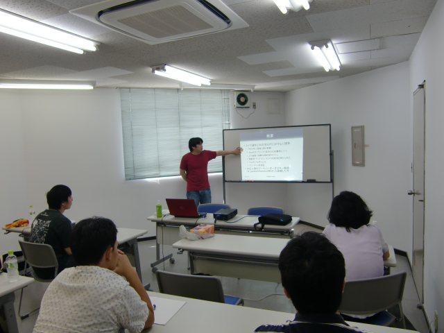
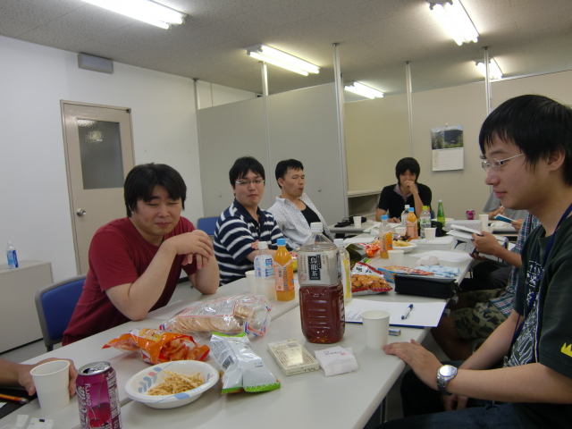

.. tkscala documentation master file, created by
   sphinx-quickstart on Sat Oct  1 10:04:22 2011.
   You can adapt this file completely to your liking, but it should at least
   contain the root `toctree` directive.

.. title:: 第0回勉強会

第0回勉強会
===========

+----------+------------------------------------------------------+
|開催日時  |2010/08/28(土) 13:00 - 15:30                          |
+----------+------------------------------------------------------+
|開催場所  |株式会社アイネット　4F会議室（岡山県倉敷市阿知1-15-5）|
+----------+------------------------------------------------------+
|定員      |20人（講師除く）                                      |
+----------+------------------------------------------------------+
|参加費    |無料                                                  |
+----------+------------------------------------------------------+

近隣の地図
----------

.. raw:: html

   

タイムテーブル
--------------

+-------------+--------+--------------------------------------------------------+
|時間         |発表者  |内容                                                    |
+=============+========+========================================================+
|13:00 - 13:30|        |自己紹介＋参加者自己紹介＋他勉強会等の告知がある方は告知|
+-------------+--------+--------------------------------------------------------+
|13:30 – 14:30|西本さん|セッション「Scalaで萌える関数型プログラミング」         |
+-------------+--------+--------------------------------------------------------+
|14:30 – 15:30|        |次回以降の勉強会の内容話し合い＆ハッピー懇親会          |
+-------------+--------+--------------------------------------------------------+

詳細
----

講演「Scala入門」

* 講師
    * 西本圭佑氏（Scalaフレームワーク「Web Flavor」開発者）
* 概要
    * プログラミング言語Scalaについての大まかな解説

次回以降の勉強会の内容話し合い

* 次回以降の勉強会の進め方（叩き台）説明・話し合い
    * 勉強会で使用する書籍の選定（現時点での候補は「Scalaスケーラブルプログラミング」）
    * Google Group 上で解決しなかった疑問点について、皆で話し合い

ハッピー懇親会

* 概要
    * 菓子・ジュース類で行う懇親会
    * 参加者各自でこれだ！と思う菓子類・ジュース類をお持ちください。

開催風景
--------

.. image:: _static/images/00/02.jpg

