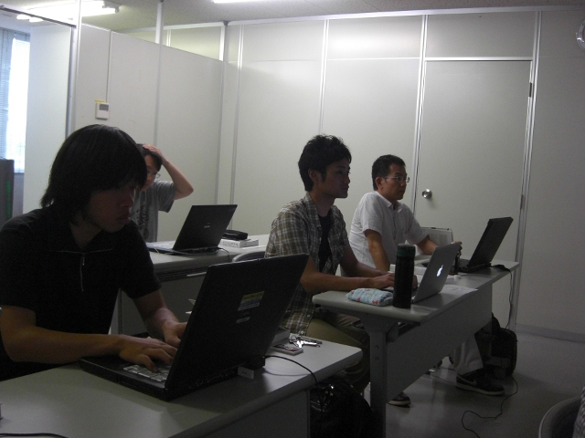
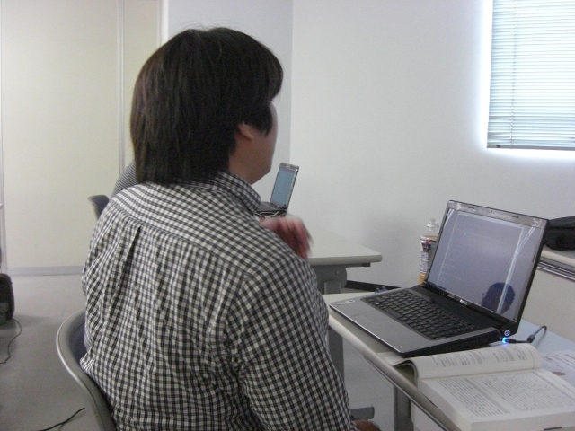

.. tkscala documentation master file, created by
   sphinx-quickstart on Sat Oct  1 10:04:22 2011.
   You can adapt this file completely to your liking, but it should at least
   contain the root `toctree` directive.

.. title:: 第1回勉強会

第1回勉強会
===========

+----------+------------------------------------------------------+
|開催日時  |2010/10/02(土) 15:00 - 17:30                          |
+----------+------------------------------------------------------+
|開催場所  |株式会社アイネット　4F会議室（岡山県倉敷市阿知1-15-5）|
+----------+------------------------------------------------------+
|定員      |20人（講師除く）                                      |
+----------+------------------------------------------------------+
|参加費    |無料                                                  |
+----------+------------------------------------------------------+

近隣の地図
----------

.. raw:: html

   

必要なもの
----------

* `Scalaプログラミング入門 <http://www.amazon.co.jp/Scala%E3%83%97%E3%83%AD%E3%82%B0%E3%83%A9%E3%83%9F%E3%83%B3%E3%82%B0%E5%85%A5%E9%96%80-%E3%83%87%E3%82%A4%E3%83%93%E3%83%83%E3%83%89%E3%83%BB%E3%83%9D%E3%83%A9%E3%83%83%E3%82%AF/dp/4822284239>`_ （学習に利用している書籍）
* ノートPC＋Scalaの実行環境（コードリーディングに必要）
* データカード等の通信環境（必要な方は）

タイムテーブル
--------------

+-------------+--------+------------------------------------------------+
|時間         |発表者  |内容                                            |
+=============+========+================================================+
|15:15 – 15:45|西本さん|重要ポイントの解説                              |
+-------------+--------+------------------------------------------------+
|15:45 – 16:15|        |未解決の疑問点について議論                      |
+-------------+--------+------------------------------------------------+
|16:15 – 17:15|        |コードリーディング                              |
+-------------+--------+------------------------------------------------+
|17:15 – 17:30|        |次回までの勉強範囲決めと次回勉強会の開催時期調整|
+-------------+--------+------------------------------------------------+
|17:30 –      |        |撤収                                            |
+-------------+--------+------------------------------------------------+

詳細
----

重要ポイントの解説

* 講師
    * 西本圭佑氏（Scalaフレームワーク「 `Web Flavor <http://webflavor.sourceforge.net/index_ja.html>`_ 」開発者/ `Scala座 <http://scalaza.com/>`_ 主催）
* 概要
    * 今回の勉強範囲の重要ポイント解説

未解決の疑問点について議論

* `Google Group <http://groups.google.co.jp/group/tenryo-kurashiki-scala>`_ 上で解決しなかった疑問点について、皆で話し合い

コードリーディング

* Scala公式のCode Examplesにある、 `Scala Snippets <http://www.scala-lang.org/node/220>`_ についてのコードリーディング

開催風景
--------

.. image:: _static/images/01/01.jpg

